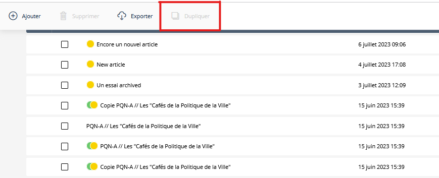
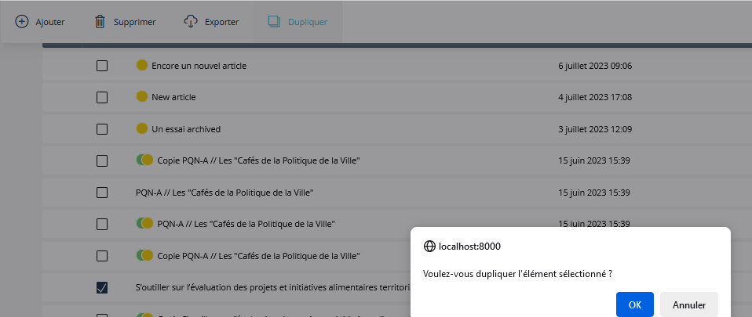
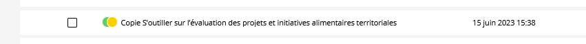

# sevengroupfrance/sulu-custom-toggle-bundle

Inspired by [this pull request](https://github.com/sulu/sulu-demo/pull/66).

## What is this bundle's goal?
Importing a custom fonctionality into [sulu](https://github.com/sulu/sulu), in this example, a custom content type.\
This bundle will import a custom toggle from the [react-switch](https://www.npmjs.com/package/react-switch) npm package.

## Installation
1. Go to your `assets/admin` folder and install the react-switch npm package `npm install react-switch`.
2. Download the [package](https://packagist.org/packages/sevengroupfrance/sulu-duplicate-articles-bundle) in your project with the following command line:\
`composer require sevengroupfrance/sulu-duplicate-articles-bundle`.
3. In `config/bundles.php` add the following code:\
`SevenGroupFrance\SuluDuplicateArticlesBundle\DuplicateArticlesBundle::class => ['all' => true]`.
4. In `assets/admin/package.json`, add the following line in the "dependencies" object:\
`"sulu-duplicate-articles-bundle": "file:node_modules/@sulu/vendor/sevengroupfrance/sulu-duplicate-articles-bundle/src/Resources/js"`.
5. In `assets/admin`, `npm install` to initialize the bundle's symlink directory.
6. In `assets/admin/index.js`, add this line:\
`import 'sulu-duplicate-articles-bundle'`.
7. In `assets/admin`, `npm run watch` or `npm run build`
8. In your environment .env, Add the variable taht'll hold the type of contents as defined in your xml in this variable : 'DUPLICATE_CONTENT_LIST="content1,content2,content3"'
9. In your config/routes/sulu_admin.yaml, add the routing logic that'll target your bundle's logic : 
'duplicate_content:
    path: /admin/api/duplicate-content
    controller: SevenGroupFrance\SuluDuplicateArticlesBundle\Controller\Admin\ContentController::duplicateContent
   
For further customisation, please refer to the [official page](https://www.npmjs.com/package/react-switch)

## Use in your tAdmin view
Once installed, you can check a any content on the list view page ( only one ) and click the button to start the cloning process

The page will then reload and your new content will be available as an unpublished draft named copie " my_content_title"

Be careful you can for now clone only one type of content at the time and only in the same content list. It may evolve in a later date.
